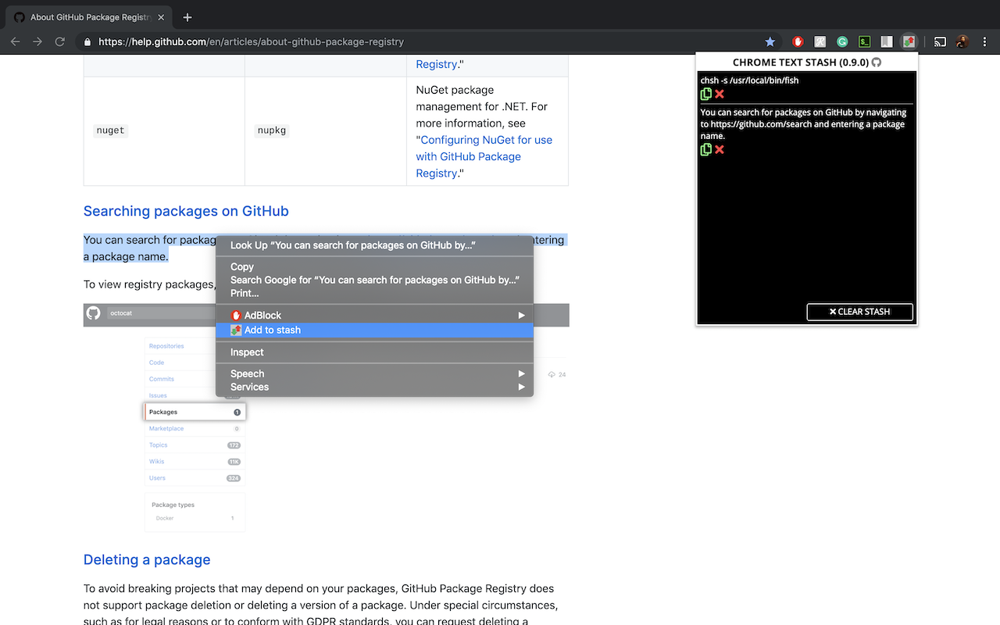

# chrome-text-stash

  

  

A Google Chrome extension to carry text across websites and computers

You can install it from the [Chrome Web Store](https://chrome.google.com/webstore/detail/chrome-text-stash/nllbcacohcpnfenocdamobclmglkbafe).

## Features

* Provides a convenient way to store small pieces of text to carry across web pages and computers as well
* More to come...

## To-do

* Implement more ways of storing and retrieving text
* Provide a display of space used and space left in the stash
* Definitely improve visuals
